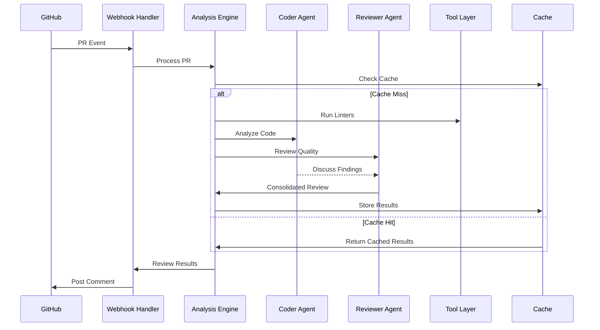

# AutoGen Code Review Bot - Architecture

## System Overview

The AutoGen Code Review Bot is a dual-agent system that provides automated code review capabilities using Microsoft AutoGen framework. The system consists of specialized "Coder" and "Reviewer" agents that collaborate to analyze pull requests and provide comprehensive feedback.

## Architecture Diagram

```
┌─────────────────────────────────────────────────────────────────┐
│                    GitHub Integration Layer                      │
├─────────────────────────────────────────────────────────────────┤
│  Webhook Handler  │  API Client  │  Comment Poster  │  Auth     │
└─────────────────────────────────────────────────────────────────┘
                                   │
┌─────────────────────────────────────────────────────────────────┐
│                      Core Analysis Engine                       │
├─────────────────────────────────────────────────────────────────┤
│  PR Analysis  │  Language Detection  │  Caching  │  Metrics     │
└─────────────────────────────────────────────────────────────────┘
                                   │
┌─────────────────────────────────────────────────────────────────┐
│                    Multi-Agent System                           │
├─────────────────────────────────────────────────────────────────┤
│              Coder Agent        │         Reviewer Agent        │
│  • Functionality Focus         │  • Quality & Security Focus   │
│  • Bug Detection              │  • Performance Analysis       │
│  • Edge Case Analysis         │  • Standards Compliance       │
└─────────────────────────────────────────────────────────────────┘
                                   │
┌─────────────────────────────────────────────────────────────────┐
│                     Tool Integration Layer                      │
├─────────────────────────────────────────────────────────────────┤
│  Linters  │  Security Tools  │  Coverage  │  Performance       │
│  • Ruff   │  • Bandit       │  • pytest │  • Profilers       │
│  • ESLint │  • CodeQL       │  • Coverage│  • Memory Tools    │
│  • Custom │  • Secrets Scan │  • Reports │  • Benchmarks      │
└─────────────────────────────────────────────────────────────────┘
```

## Core Components

### 1. GitHub Integration (`github_integration.py`)
- **Webhook Processing**: Handles GitHub webhook events for PR activities
- **API Communication**: Interfaces with GitHub API for repository operations
- **Authentication**: Manages GitHub token security and permissions
- **Comment Management**: Posts review results as PR comments

### 2. Agent System (`agents.py`, `agent_templates.py`)
- **Coder Agent**: Focuses on implementation logic, bug detection, and edge cases
- **Reviewer Agent**: Emphasizes security, performance, and coding standards
- **Agent Conversations**: Manages multi-agent dialogues and consensus building
- **Template System**: Provides consistent agent behavior patterns

### 3. Analysis Engine (`pr_analysis.py`)
- **Change Detection**: Identifies modified files and change patterns
- **Language Recognition**: Automatic programming language detection
- **Parallel Processing**: Concurrent analysis for multiple languages
- **Result Aggregation**: Combines agent findings into unified reports

### 4. Caching System (`caching.py`)
- **Result Storage**: Caches analysis results by commit hash
- **TTL Management**: Automatic cleanup of expired cache entries
- **Configuration Hashing**: Cache invalidation on config changes
- **Performance Optimization**: Reduces redundant analysis operations

### 5. Security Framework (`token_security.py`, `subprocess_security.py`)
- **Token Management**: Secure handling of GitHub tokens and secrets
- **Process Isolation**: Safe execution of external tools and linters
- **Path Traversal Protection**: Prevents malicious file access
- **Input Validation**: Sanitizes user inputs and webhook data

## Data Flow



## Design Decisions

### Agent Specialization
- **Rationale**: Separate concerns between functionality and quality aspects
- **Benefits**: More thorough analysis, specialized expertise, collaborative refinement
- **Trade-offs**: Increased complexity, potential for conflicting recommendations

### Caching Strategy
- **Key Format**: `{commit_hash}_{config_hash}_{language}`
- **Storage**: Local filesystem with configurable location
- **Invalidation**: Time-based (24h default) and configuration-based
- **Benefits**: 5x+ performance improvement for repeated analyses

### Parallel Processing
- **Granularity**: Language-level and check-level parallelism
- **Thread Safety**: All operations are thread-safe and cache-compatible
- **Resource Management**: Automatic worker optimization based on detected languages
- **Benefits**: 2-3x speedup for multi-language repositories

### Security Model
- **Principle of Least Privilege**: Minimal required permissions
- **Defense in Depth**: Multiple security layers (token, process, filesystem)
- **Audit Trail**: Comprehensive logging of security-relevant operations
- **Regular Updates**: Automated dependency scanning and updates

## Technology Stack

### Core Framework
- **Python 3.8+**: Primary development language
- **Microsoft AutoGen**: Multi-agent conversation framework
- **FastAPI/Flask**: Web framework for webhook handling
- **SQLAlchemy**: Database ORM for persistent storage

### Integration Tools
- **PyGitHub**: GitHub API client library
- **PyYAML**: Configuration file processing
- **Requests**: HTTP client for external APIs
- **psutil**: System monitoring and resource tracking

### Quality Tools
- **Ruff**: Python linting and formatting
- **Bandit**: Security vulnerability scanner
- **pytest**: Testing framework with coverage
- **pre-commit**: Git hook management

## Deployment Architecture

### Production Environment
```
┌─────────────────────────────────────────────────────────────────┐
│                    Load Balancer / Reverse Proxy                │
└─────────────────────────────────────────────────────────────────┘
                                   │
┌─────────────────────────────────────────────────────────────────┐
│              Application Servers (Kubernetes Pods)              │
├─────────────────────────────────────────────────────────────────┤
│  Bot Instance 1  │  Bot Instance 2  │  Bot Instance 3          │
└─────────────────────────────────────────────────────────────────┘
                                   │
┌─────────────────────────────────────────────────────────────────┐
│                    Shared Storage & Services                    │
├─────────────────────────────────────────────────────────────────┤
│  Redis Cache  │  PostgreSQL  │  Metrics Store  │  Log Store    │
└─────────────────────────────────────────────────────────────────┘
```

### Scaling Considerations
- **Horizontal Scaling**: Stateless application design enables easy scaling
- **Resource Isolation**: Container-based deployment with resource limits
- **Queue Management**: Redis-based job queue for handling webhook bursts
- **Database Optimization**: Read replicas for analytics and reporting

## Monitoring & Observability

### Metrics Collection
- **Application Metrics**: Response times, error rates, throughput
- **Business Metrics**: Reviews per day, agent accuracy, user satisfaction
- **System Metrics**: CPU, memory, disk usage, network traffic
- **Security Metrics**: Failed authentications, suspicious activities

### Health Checks
- **Liveness**: Basic application responsiveness
- **Readiness**: Database connectivity, external service availability
- **Startup**: Initialization progress and dependency checks

### Alerting Strategy
- **Error Rate**: >5% error rate triggers immediate alert
- **Response Time**: >30s average response time triggers warning
- **Resource Usage**: >80% CPU/memory usage triggers scaling alert
- **Security Events**: Any security violation triggers immediate alert

## Future Enhancements

### Short Term (Next Release)
- **Multi-Repository Support**: Single bot instance managing multiple repositories
- **Custom Rule Engine**: User-defined review rules and criteria
- **Integration Tests**: Automated test generation suggestions
- **Performance Profiling**: Built-in code performance analysis

### Medium Term (6 months)
- **Machine Learning**: Agent learning from review feedback
- **API Gateway**: RESTful API for external integrations
- **Dashboard**: Web-based monitoring and configuration interface
- **Compliance Reporting**: Automated compliance and audit reports

### Long Term (1+ years)
- **Multi-Language Agents**: Specialized agents per programming language
- **Code Generation**: AI-powered code suggestion and auto-fixing
- **Enterprise Features**: SSO, RBAC, enterprise monitoring
- **Cloud-Native**: Serverless deployment options and edge computing